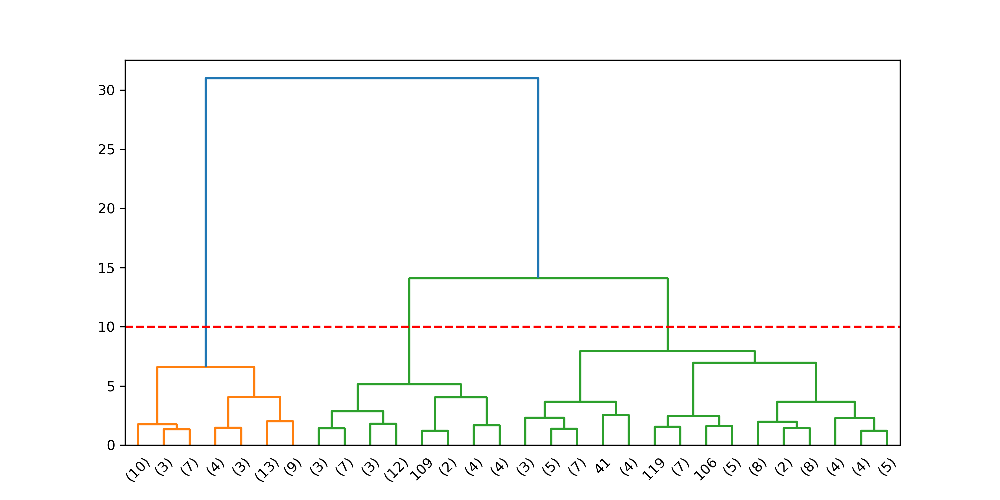
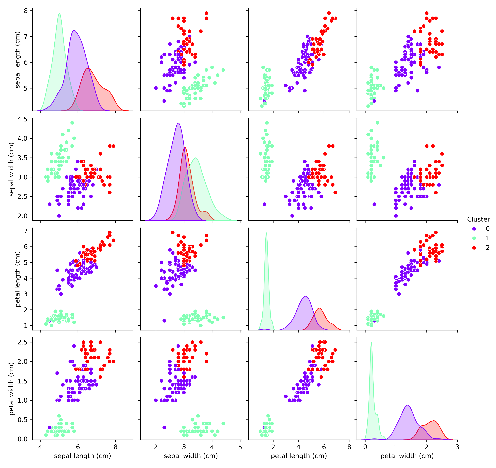

# Hierarchical-Clustering-Iris
This project demonstrates Hierarchical (Agglomerative) Clustering on the Iris dataset. dendrogram is plotted, and clusters are assigned. Pair plot and Scatter plot visualizes how the flowers naturally group into three distinct clusters.


# Hierarchical Clustering on Iris Dataset 🌸

This project demonstrates Hierarchical (Agglomerative) Clustering on the Iris dataset. dendrogram is plotted, and clusters are assigned. Pair plot and Scatter plot visualizes how the flowers naturally group into three distinct clusters.
The process includes scaling, dendrogram visualization, and final clustering with scatter plots and pair plots.

---

## 📊 Project Workflow
1. **Load Dataset** – Iris dataset from `sklearn`.  
2. **Preprocess Data** – Standard scaling of features.  
3. **Dendrogram** – Visualize hierarchical merging and decide optimal number of clusters.  
4. **Agglomerative Clustering** – Assign cluster labels.  
5. **Visualization** – Scatter plots and pair plots to show cluster separation.

---

## 📷 Visualizations

### 🔹 Pair Plot of Actual Data


### 🔹 Dendrogram


### 🔹 Scatter Plot (Petal Length vs Petal Width)
.png)

### 🔹 Pair Plot (All Features with Clusters)
  


---

## ⚙️ Technologies Used
- Python 🐍  
- Pandas  
- Matplotlib & Seaborn  
- Scikit-learn  
- Scipy  

---

## 🚀 How to Run
```bash
 Clone this repository
git clone https://github.com/WaleedAfridi-1/Hierarchical-Clustering-Iris.git

# Open Jupyter Notebook
jupyter notebook hierarchical-clustering-iris.ipynb
```

## 📌 Results

- The dendrogram suggests an **optimal number of 3 clusters**.  
- Scatter plot shows clear grouping based on petal features.  
- Pair plots confirm that hierarchical clustering effectively separates the three Iris species.  

---

## ✍️ Author

**Waleed Afridi**  
Data Science | Ai Enthusiast  

